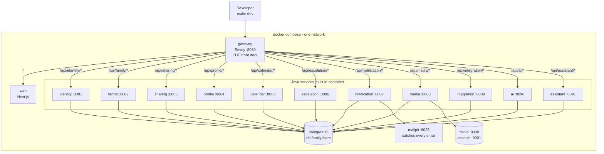
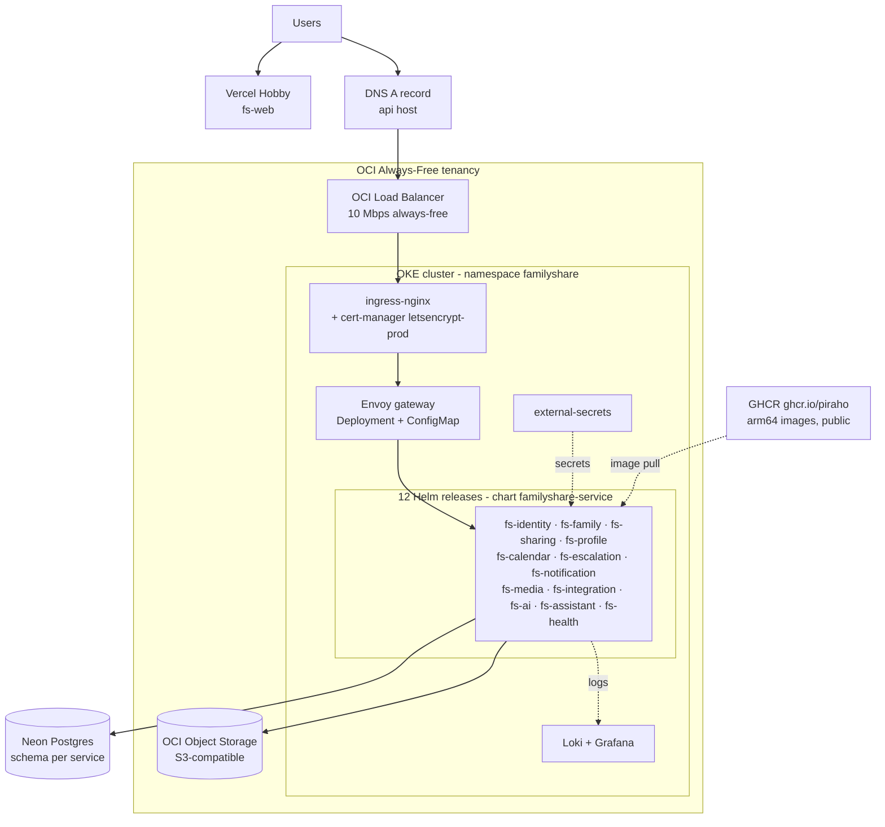
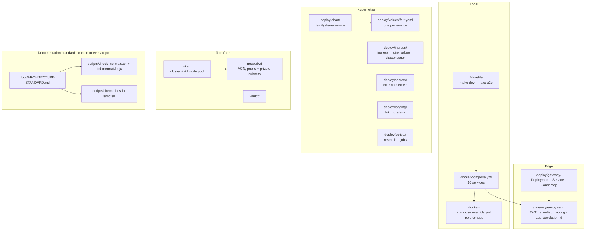
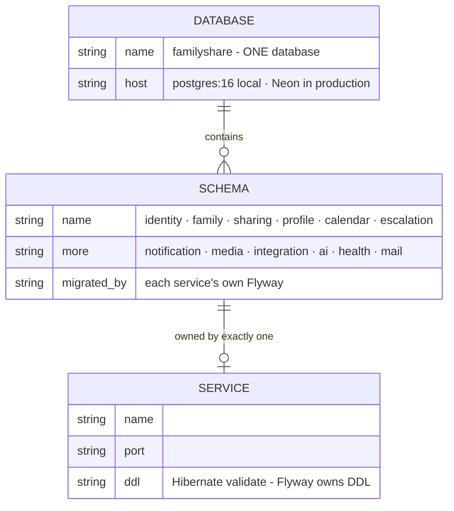
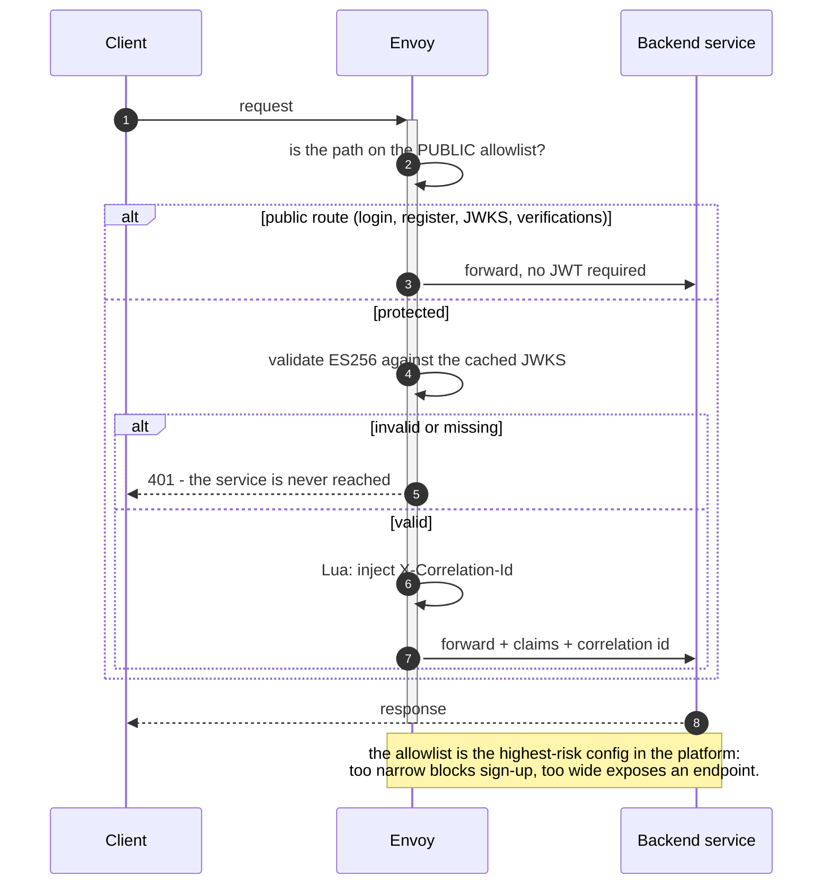
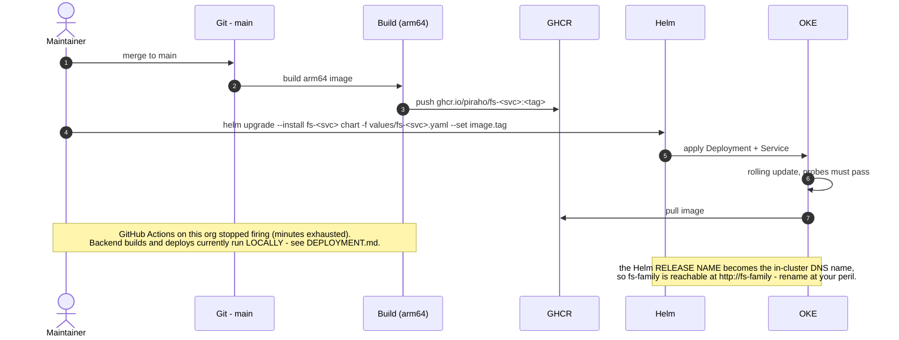
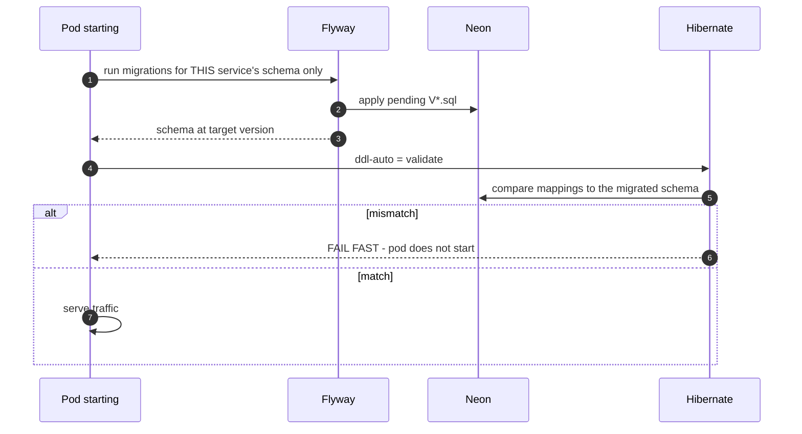
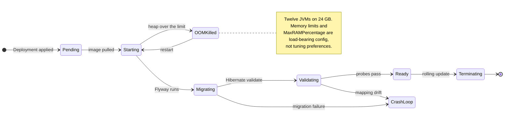

# fs-infra — Architecture

> The **composition root**. Where twelve independently deployable services become one system — locally as a
> 16-container compose stack, in production as Helm releases on an OCI free-tier Kubernetes cluster behind
> an Envoy edge.
> Companion to [`README.md`](./README.md), [`DEPLOYMENT.md`](./DEPLOYMENT.md),
> [`DB-MIGRATIONS.md`](./DB-MIGRATIONS.md), and [`STATUS.md`](./STATUS.md).
> Governed by the [Architecture Documentation Standard](./docs/ARCHITECTURE-STANDARD.md) —
> every diagram is compiled in CI. **This repo is also the source of truth for that standard and its tooling.**

| | |
|---|---|
| **Local** | `docker compose` — 16 containers, one network, one front door on `:8080` |
| **Production** | OCI OKE (Ampere A1, **arm64**), 2 nodes within the always-free 4 OCPU / 24 GB grant |
| **Images** | GHCR (`ghcr.io/piraho`), public — no pull secret |
| **Database** | Neon (free tier), one database, **schema per service** |
| **Frontend** | Vercel (Hobby) for fs-web; also containerised behind Envoy locally |
| **Namespace** | `familyshare` |

---

## 1. Responsibility

**Owns.** The local compose stack · the Envoy edge configuration (JWT validation, public-route allowlist,
`/api/<svc>/*` routing, correlation-id injection) · the `familyshare-service` Helm chart and per-service
values · Terraform for the OKE cluster and VCN · ingress, cert-manager, external-secrets, and the
Loki/Grafana logging stack · database reset and migration jobs · **the Architecture Documentation Standard
and its `scripts/`**, which every other repo copies.

**Does not own.** Any business logic. fs-infra is wiring — and the one place where a change affects every
service at once.

---

## 2. System context

### 2.1 Local development

**One port, same origin.** Envoy serves the web app and every `/api/*` backend on `:8080`, so the frontend
needs no CORS handling and no per-environment API URL. The Java services build **inside** the containers via
a multi-stage Gradle build — no local JDK required, which is what makes `make dev` a single command on a
fresh machine.

### 2.2 Production

**Everything here is free-tier, and the constraints show.** Two A1 nodes hold 24 GB for twelve JVMs, so
memory sizing is not a tuning exercise — it is the binding constraint on how many services can run at all.

---

## 3. Component structure

---

## 4. Data model

**Not applicable — fs-infra owns no schema.** It owns the *topology* of everyone else's:

**One database, schema per service (DEC-0024/0035).** Free-tier Neon gives one database; isolation is by
schema, and each service migrates only its own. The rules that keep this honest:

- **No cross-schema foreign keys.** Cross-service references are by value (`members.user_id`,
  `person_identity.ref_id`). An FK would weld two services into one migration unit.
- **`mail` is the one shared schema**, written by fs-identity and drained by the dreamlit provider.
- **Every service is `ddl-auto=validate`** — Flyway owns DDL; a drifted mapping fails at boot, not in prod.

---

## 5. Request flows

### 5.1 Edge request handling

**This is where a real bug lived.** `/v1/verifications` was missing from the allowlist, so Envoy 401'd
email verification — every service's own tests passed, and sign-up was broken in the browser. It was caught
by fs-e2e, which is precisely why that suite drives everything through the edge.

### 5.2 Deploy

### 5.3 Migration on deploy

---

## 6. State machines

---

## 7. Failure modes & invariants

| Invariant | Rule |
|---|---|
| One front door | All client traffic goes through Envoy — never a service port |
| Allowlist is explicit | Public routes are enumerated; everything else needs a valid JWT |
| Correlation everywhere | `X-Correlation-Id` is injected at the edge and propagated |
| Schema per service | No cross-schema FKs; each service migrates only its own |
| Flyway owns DDL | Every service is `ddl-auto=validate` |
| Release name = DNS name | Renaming a Helm release renames the in-cluster host |
| arm64 | A1 nodes are ARM — an amd64 image will not run |

| Failure | Blast radius | Notes |
|---|---|---|
| **Envoy misconfigured** | **Total** | Highest-risk config on the platform. A missing allowlist entry breaks sign-up; an over-broad one exposes an endpoint |
| **JVM heap over the limit** | Per service, restarts | Resolved by 512→768Mi + `MaxRAMPercentage=60`; zero restarts since |
| Neon unavailable | Total | Single free-tier database |
| A1 capacity exhausted | Cannot provision | "Out of host capacity" on `terraform apply` — retry, or another AD/region |
| GHCR unreachable | New pods cannot start | Running pods unaffected |
| Signing key not shared | Intermittent 401s platform-wide | `FAMILYSHARE_JWT_SIGNING_KEY` **must** be one shared secret |

### The network posture, stated plainly

The cluster runs the **flannel** CNI, which does **not enforce NetworkPolicies**. Every `/internal/*`
endpoint is therefore protected by a **shared `X-Internal-Key`**, not by network isolation — an interim
control (H4), not the intended end state. Anyone reasoning about the security of `/internal/*` should start
from that fact rather than assuming pod-level segmentation exists.

---

## 8. Change protocol

| When you change… | Redraw / update |
|---|---|
| `docker-compose.yml` | §2.1 · README service table |
| `gateway/envoy.yaml` | §2.1 · §5.1 · §7 — **run fs-e2e**, the allowlist is where sign-up breaks |
| `deploy/chart/**` or `deploy/values/**` | §2.2 · §3 · §6 |
| `terraform/**` | §2.2 · `DEPLOYMENT.md` |
| a new service | §2.1 **and** §2.2 · §4 (its schema) · a values file · an Envoy route |
| resource limits | §6 · §7 — the memory envelope is a hard constraint |
| **the Architecture Standard or `scripts/`** | re-distribute to **every** repo — this repo is the source of truth |

CI enforces this: `scripts/check-docs-in-sync.sh` (`deploy/**`, `gateway/**`, `terraform/**` are all
architecture-significant here) + `scripts/check-mermaid.sh`.
